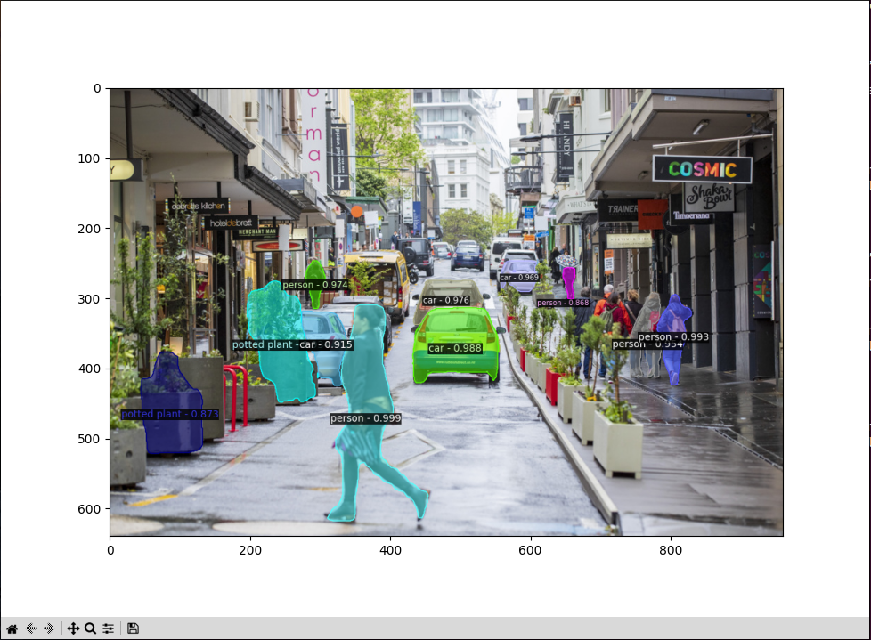
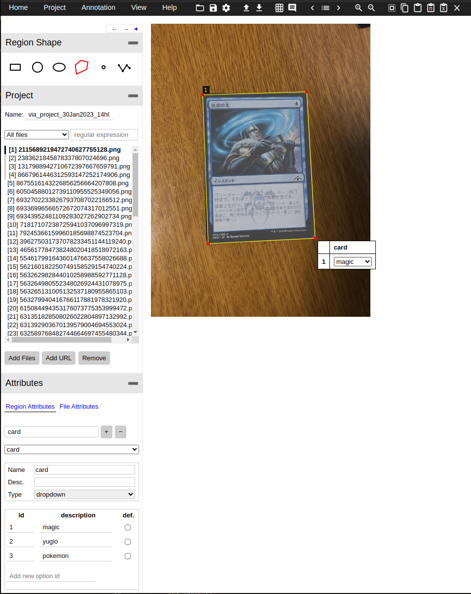
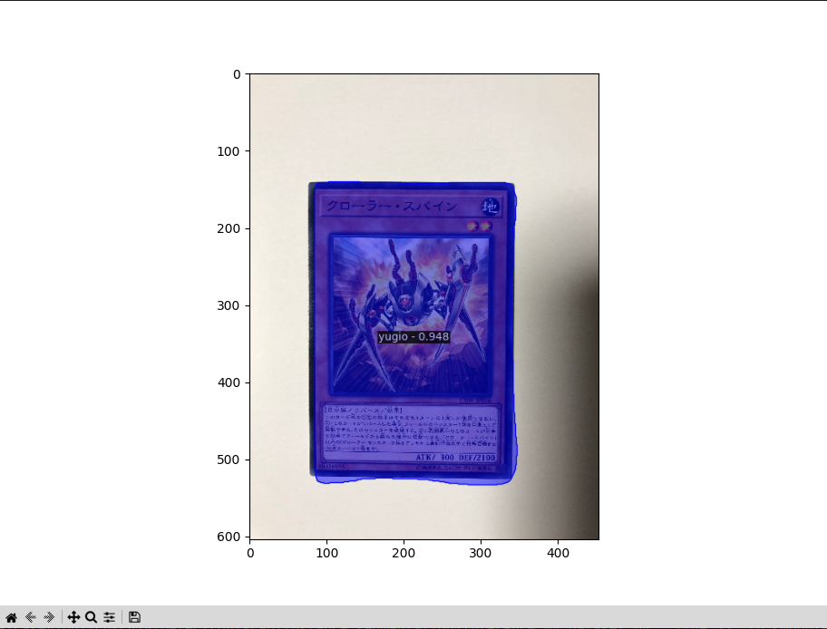
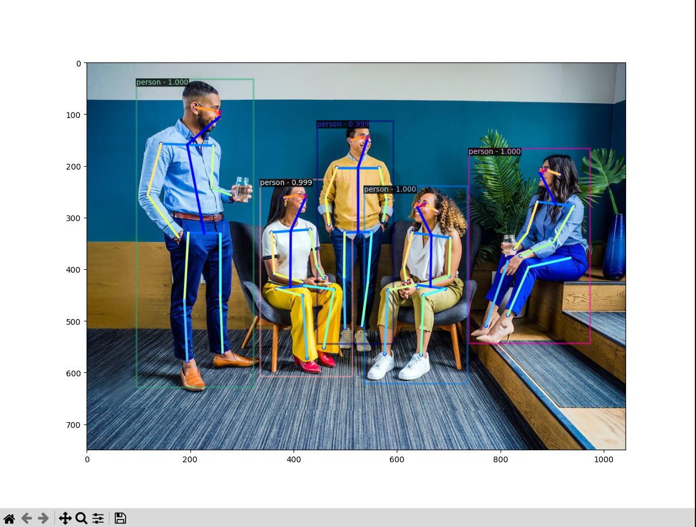
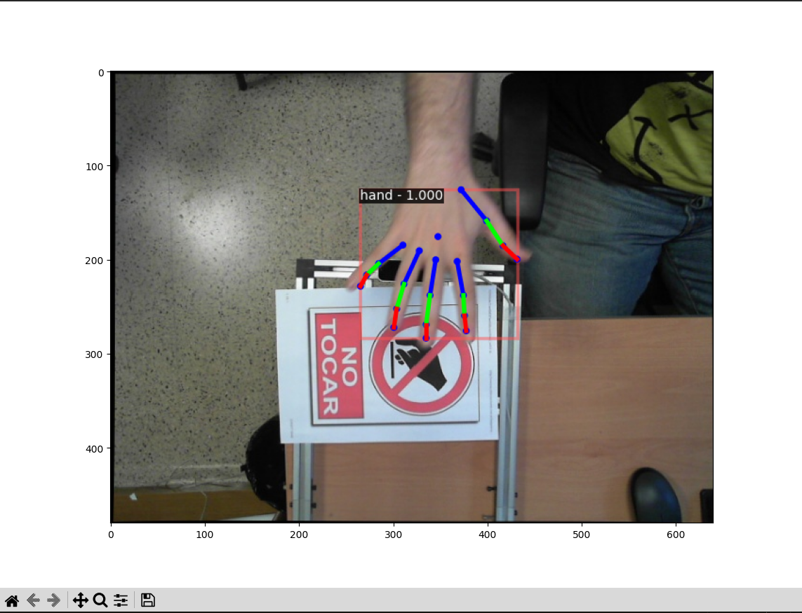

# Detectron2 Lab
 
The goal of this lab is to provide an introduction to the computer vision tasks objection detection, instance segmentation, and keypoint detection using deep neural networks. We do this using the Detectron2 project which provides a range of implemented methods, as well as pre-trained models.

Copy the lab to your local drive
`cp -r /csse/misc/course/cosc428/labs/Detectron2-Lab /local/labs/Detectron2-Lab`

If you are outside university, the scripts can be downloaded from the gitlab repository (Note: this does not include model files, or data)
`git clone https://eng-git.canterbury.ac.nz/cpe44/Detectron2-Lab.git`

Activate enviroment for detectron2 lab
`source /csse/misc/course/cosc428/enviroments/detectron2/bin/activate`

# Object Detection

## Inference using COCO pretrained model

### TODO:

(Github clone only)
- Download model from `https://dl.fbaipublicfiles.com/detectron2/COCO-Detection/faster_rcnn_R_50_FPN_1x/137257794/model_final_b275ba.pkl` and copy to `./object_detection/weights/model_final_b275ba.pkl`

- Move to object detection directory `cd object_detection`
- Run objection detection inference script `python inference_coco_dataset.py`

## Labeling cards

### TODO:
 - Open `via_mod.html` using a web browser
 - Add files from `./data/cards_train` 'cards_train'
 - Add a 'card' region atribute of type drop down
 - Add ids 1-3 with descriptions 'magic', 'yugio', and 'pokemon' (these are our classes)
 - Use the rectangle region shape to annotate the card, and add a card classes using the drop down menu
 - Repeat for all cards (or atleast ~30)
 - Under the Annotation menu, select 'Export Annotations (COCO format)'
 - Move the downloaded json file to `./object_detection/labels/cards_train.json`
 - Repeat for 'cards_test' directory

### What you should see:

## Training card object detector

### TODO:
 - Run object detection training script `python train.py`

### What you should see:
`[11/14 20:41:39 d2.utils.events]:  eta: 0:01:51  iter: 19  total_loss: 1.589  loss_cls: 1.439  loss_box_reg: 0.1429  loss_rpn_cls: 0.004999 loss_rpn_loc: 0.004084  time: 0.1136  data_time: 0.0048  lr: 4.9953e-06  max_mem: 2030M`

`[11/14 20:41:42 d2.utils.events]:  eta: 0:01:47  iter: 39  total_loss: 1.481  loss_cls: 1.316  loss_box_reg: 0.1354  loss_rpn_cls: 0.003877  loss_rpn_loc: 0.003786  time: 0.1121  data_time: 0.0018  lr: 9.9902e-06  max_mem: 2030M`

`[11/14 20:41:44 d2.utils.events]:  eta: 0:01:48  iter: 59  total_loss: 1.27  loss_cls: 1.114  loss_box_reg: 0.1318  loss_rpn_cls: 0.00459  loss_rpn_loc: 0.005093  time: 0.1140  data_time: 0.0019  lr: 1.4985e-05  max_mem: 2030M`

`[11/14 20:41:46 d2.utils.events]:  eta: 0:01:47  iter: 79  total_loss: 0.974  loss_cls: 0.8542  loss_box_reg: 0.1418  loss_rpn_cls: 0.004968  loss_rpn_loc: 0.003661  time: 0.1148  data_time: 0.0019  lr: 1.998e-05  max_mem: 2030M`

`[11/14 20:41:49 d2.utils.events]:  eta: 0:01:43  iter: 99  total_loss: 0.7066  loss_cls: 0.5575  loss_box_reg: 0.1449  loss_rpn_cls: 0.003264  loss_rpn_loc: 0.004681  time: 0.1136  data_time: 0.0018  lr: 2.4975e-05  max_mem: 2030M`

## Inference using card model

### TODO:
 - Run object detection training script `python inference_my_dataset.py`

### What you should see:

# Instance Segmentation

## Inference using COCO pretrained model

### TODO:
- Download model from `https://dl.fbaipublicfiles.com/detectron2/COCO-InstanceSegmentation/mask_rcnn_R_50_FPN_3x/137849600/model_final_f10217.pkl` and copy to `./instance_segmentation/weights/model_final_f10217.pkl`

- Move to object detection directory `cd instance_segmentation`
- Run objection detection inference script `python inference_coco_dataset.py`

### What you should see:

## Labeling cards

### TODO:
 - Open `via_mod.html` using a web browser
 - Add files from `./data/cards_train`
 - Add a 'card' region atribute of type drop down
 - Add ids 1-3 with descriptions 'magic', 'yugio', and 'pokemon' (these are our classes)
 - Use the n-point polygon shape to annotate the card, and add a card classes using the drop down menu
 - Repeat for all cards (or atleast ~30)
 - Under the Annotation menu, select 'Export Annotations (COCO format)'
 - Move the downloaded json file to `./instace_segmentation/labels/cards_train.json`
 - Repeat for 'cards_test' directory

### What you should see:

## Training card instance segmentation

### TODO:

### What you should see:
`[11/15 22:13:34 d2.utils.events]:  eta: 0:01:46  iter: 19  total_loss: 3.77  loss_cls: 2.55  loss_box_reg: 0.5046  loss_mask: 0.6948  loss_rpn_cls: 0.00397  loss_rpn_loc: 0.004189  time: 0.1099  data_time: 0.0050  lr: 4.9953e-06  max_mem: 2065M`

`[11/15 22:13:37 d2.utils.events]:  eta: 0:01:45  iter: 39  total_loss: 3.687  loss_cls: 2.433  loss_box_reg: 0.595  loss_mask: 0.6741  loss_rpn_cls: 0.00226  loss_rpn_loc: 0.004699  time: 0.1112  data_time: 0.0018  lr: 9.9902e-06  max_mem: 2065M`

`[11/15 22:13:39 d2.utils.events]:  eta: 0:01:43  iter: 59  total_loss: 3.279  loss_cls: 2.058  loss_box_reg: 0.5784  loss_mask: 0.6378  loss_rpn_cls: 0.002329  loss_rpn_loc: 0.005039  time: 0.1109  data_time: 0.0020  lr: 1.4985e-05  max_mem: 2065M`

`[11/15 22:13:41 d2.utils.events]:  eta: 0:01:41  iter: 79  total_loss: 2.704  loss_cls: 1.592  loss_box_reg: 0.5743  loss_mask: 0.5783  loss_rpn_cls: 0.003894  loss_rpn_loc: 0.00432  time: 0.1100  data_time: 0.0018  lr: 1.998e-05  max_mem: 2065M`

`[11/15 22:13:43 d2.utils.events]:  eta: 0:01:38  iter: 99  total_loss: 2.178  loss_cls: 1.019  loss_box_reg: 0.6209  loss_mask: 0.5191  loss_rpn_cls: 0.002507  loss_rpn_loc: 0.003703  time: 0.1096  data_time: 0.0018  lr: 2.4975e-05  max_mem: 2065M`

## Inference using card model

### TODO:

### What you should see:

# Keypoint Detection (Pose Estimation)
Pose Estimation is the process of determining what pose a person is currently in based on some data. For example, where keypoints such as their head, hands, feet and joints are. There are a range of applications for this; the most common being for use in the film or video game industry. Until recently, the best option for those who couldn’t afford massive camera arrays and dozens of reflective dots, was to apply 3D camera technology. The most notable implementation of this method came from Microsoft with the Kinect camera on the Xbox 360.

## Inference using COCO pretrained model

### TODO:
- Move to object detection directory `cd keypoint_detection`
- Run objection detection inference script `python inference_coco_dataset.py`

### What you should see:

## Inference using multiview_hands dataset trained model
- Run hand keypoint detectron inference script `python inference_hand_dataset.py`

### What you should see:

- Run live hand keypoint detectron inference script `python inference_hand_dataset_live.py`

## (Optional) Generating COCO format keypoint labels
If you would like to train keypoint detectron on your own dataset, the specification can be found [here](https://cocodataset.org/#format-data). Note that unless your dataset labels are already in COCO format you will have to write your own script for the conversion.

- `cd hand_dataset_scripts`
- `python raw_to_coco_multiview.py`

The coco format labels output from this script can be found at `./keypoint_detection/labels/multiview_hands.json`

## (Optional) Training hand keypoint detection
Finally if you would like to train the keypoint detection network on the hand or other dataset, you can use the train script below.

- `python train.py`