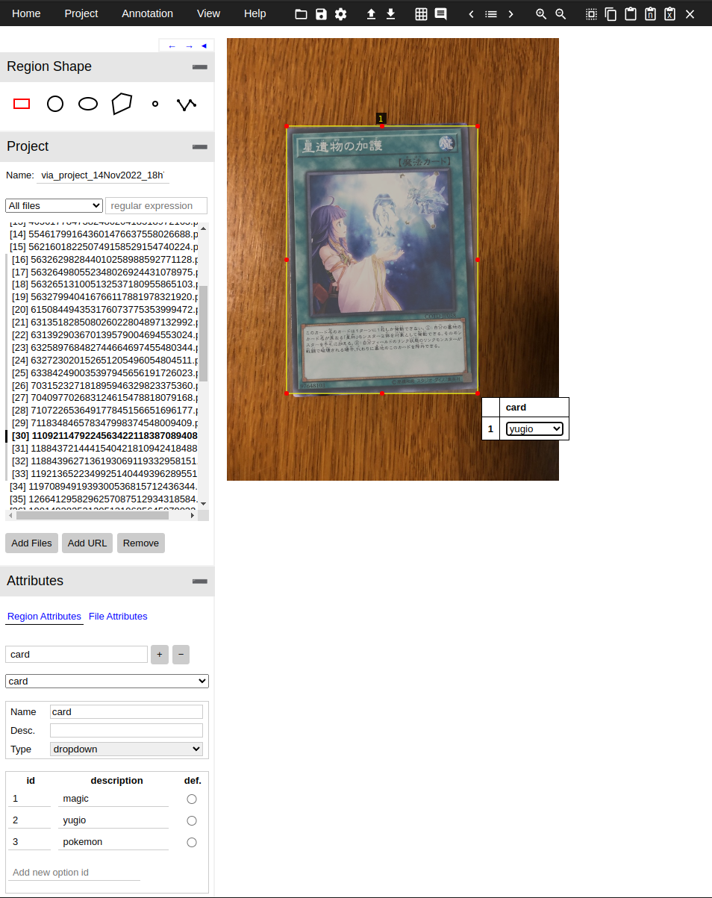
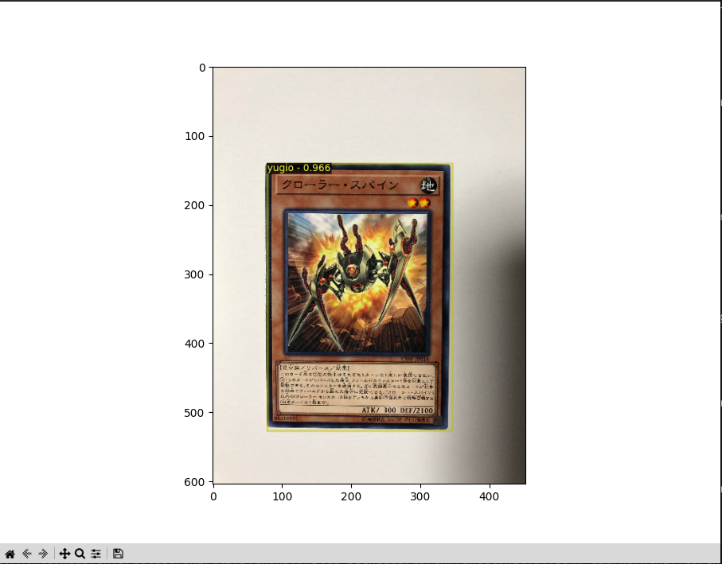

# Detectron2 Lab

# Object Detection

## Inference using pretrained model

### TODO:
 - Copy weights file from xxx to ./object_detection/weights/model_final_b275ba.pkl
 - Move to object detection directory `cd object_detection`
 - Run objection detection inference script `python inference.py`

## Labeling cards

### TODO:
 - Open `via_mod.html` using a web browser
 - Add files from xxx 'cards_train'
 - Add a 'card' region atribute of type drop down
 - Add ids 1-3 with descriptions 'magic', 'yugio', and 'pokemon' (these are our classes)
 - Use the rectangle region shape to annotate the card, and add a card classes using the drop down menu
 - Repeat for all cards (or atleast ~30)
 - Under the Annotation menu, select 'Export Annotations (COCO format)'
 - Move the downloaded json file to 'object_detection/labels/cards_train.json'
 - Repeat for 'cards_test' directory

### What you should see:

## Training card object detector

### TODO:
 - Run object detection training script 'python train.py'
 - 

### What you should see:
`[11/14 20:41:39 d2.utils.events]:  eta: 0:01:51  iter: 19  total_loss: 1.589  loss_cls: 1.439  loss_box_reg: 0.1429  loss_rpn_cls: 0.004999 loss_rpn_loc: 0.004084  time: 0.1136  data_time: 0.0048  lr: 4.9953e-06  max_mem: 2030M`

`[11/14 20:41:42 d2.utils.events]:  eta: 0:01:47  iter: 39  total_loss: 1.481  loss_cls: 1.316  loss_box_reg: 0.1354  loss_rpn_cls: 0.003877  loss_rpn_loc: 0.003786  time: 0.1121  data_time: 0.0018  lr: 9.9902e-06  max_mem: 2030M`

`[11/14 20:41:44 d2.utils.events]:  eta: 0:01:48  iter: 59  total_loss: 1.27  loss_cls: 1.114  loss_box_reg: 0.1318  loss_rpn_cls: 0.00459  loss_rpn_loc: 0.005093  time: 0.1140  data_time: 0.0019  lr: 1.4985e-05  max_mem: 2030M`

`[11/14 20:41:46 d2.utils.events]:  eta: 0:01:47  iter: 79  total_loss: 0.974  loss_cls: 0.8542  loss_box_reg: 0.1418  loss_rpn_cls: 0.004968  loss_rpn_loc: 0.003661  time: 0.1148  data_time: 0.0019  lr: 1.998e-05  max_mem: 2030M`

`[11/14 20:41:49 d2.utils.events]:  eta: 0:01:43  iter: 99  total_loss: 0.7066  loss_cls: 0.5575  loss_box_reg: 0.1449  loss_rpn_cls: 0.003264  loss_rpn_loc: 0.004681  time: 0.1136  data_time: 0.0018  lr: 2.4975e-05  max_mem: 2030M`

## Inference using card model

### TODO:
 - Run object detection training script 'python inference_my_dataset.py'
 - 

### What you should see:

# Instance Segmentation